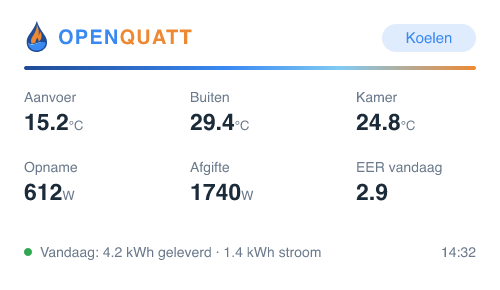
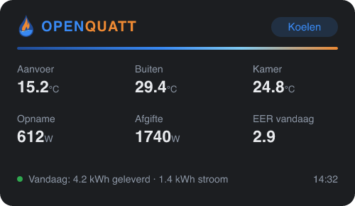

<p align="center">
  
</p>

<h1 align="center">OpenQuatt for Homey</h1>

<p align="center">
  Monitor and control your <a href="https://github.com/OpenQuatt/OpenQuatt">OpenQuatt</a> heat pump controller from Homey Pro — fully local, real-time, zero cloud.
</p>

<p align="center">
  
  
  
  
</p>

---

## ✨ Features

### Device

Pair your Heatpump Controller Q-edition in seconds — it is discovered automatically on your network via mDNS (with a manual IP override if you need it).

| Capability | Source |
|---|---|
| Supply / outside / room temperature | live, pushed by the controller |
| Dew point (as selected by the controller) | live |
| Power consumption | live |
| Control mode (CM0…CM100) | live |
| Aux relay (R2) function picker | all five firmware modes, switchable from Homey |
| Aux relay status | live status text from the control loop |
| Manual cooling enable & R2 relay toggles | direct control |

### Flow cards

- **Triggers** — control mode changed (with mode token), heating started/stopped, cooling started/stopped, a fault was detected/resolved (with fault description token), defrosting started/stopped (per heat pump), boiler turned on/off, silent mode turned on/off, the dew point became available / was lost
- **Conditions** — is heating, is cooling, a fault is active, is defrosting, the boiler is active, silent mode is active, aux relay function is …, a dew point is available, cooling is permitted
- **Actions** — set manual cooling enable, force control mode (standby / circulate / anti-freeze / automatic), set silent mode override, set boiler assist, set OpenQuatt control on/off, set aux relay function, switch the R2 relay (external control mode), send a dew point to the controller, update the dew point for a room from temperature + humidity

### Dew point & cooling safety

OpenQuatt only cools when it knows the indoor dew point: the supply water must stay above it (plus a safety margin), or condensation would form on your floor and pipes. This app can feed that dew point straight from the sensors you already have in Homey — the same role the Home Assistant dynamic-cooling package plays, including the identical Magnus formula and highest-room-wins aggregation.

On firmware with [API input support](https://github.com/OpenQuatt/OpenQuatt/blob/main/docs/api-input.md) this needs **zero configuration**: the app posts the dew point directly to the controller's API input over the local connection it already uses. Just add the flows:

- For each room you cool: *when* temperature or humidity of the room sensor changes → *then* **Update the dew point for [room] from temperature and humidity**, using the sensor tags. Rooms are aggregated with highest-wins, values expire automatically (configurable, 60 min default), and the last aggregate is re-sent every minute so the controller's 15-minute staleness check keeps passing.
- Already have a computed dew point? Use the simpler **Send dew point to the controller** card instead.

On older firmware without the API input, MQTT works as fallback: enable *MQTT input sources* in the OpenQuatt web app (*Settings → Sources / integrations*), point it at a broker on your network, and fill in the same broker under *Dew point — MQTT fallback* on the OpenQuatt device in Homey. The [MQTT Server](https://homey.app/a/net.weejewel.mqttserver/) app turns your Homey Pro itself into that broker — use the username and password from its app settings on both sides, as it does not accept anonymous connections.

The device also shows the dew point the controller actually selected, and the *dew point available / lost* triggers plus the *cooling is permitted* condition let you alert on a broken sensor before a hot day does it for you.

### Dashboard widget

A branded, glanceable status card for your phone:

<p align="center">
  
  
</p>

- Mode badge that follows the controller: standby, heating, cooling, anti-freeze, offline
- Six live stats: supply / outside / room temperature, power in, thermal power out, today's COP (or EER while cooling)
- Smart status line: **active faults** (heat pump failures, low-flow protection, flow mismatch, OpenTherm link issues) take priority in red; otherwise today's delivered energy and consumption

## 🔌 How it works

The app talks to the ESPHome web server that OpenQuatt already runs on port 80 — the same interface the OpenQuatt web app uses:

- **State**: one persistent Server-Sent Events stream on `GET /events`. Every entity state arrives on connect and is pushed on every change — real-time, no polling.
- **Commands**: the REST routes, addressed by URL-encoded display name (`POST /switch/Manual%20Cooling%20Enable/turn_on`). These also reach `internal: true` entities such as the aux relay configuration.

Unlike the Home Assistant integration (which uses the ESPHome native API on port 6053), no API encryption key or pairing window is needed. The load on the ESP equals a single open browser tab of the web UI, and there are **zero runtime npm dependencies**.

## 🚀 Installation

Until the app is published in the Homey App Store, install it in developer mode:

```bash
git clone https://github.com/OpenQuatt/homey-openquatt.git
cd homey-openquatt
npm i -g homey     # Athom CLI (once)
homey login
homey app install  # or `homey app run` for live development
```

Requires a **Homey Pro (2023 or newer)** — widgets and local apps need firmware ≥ 12.3.0.

Don't have the hardware yet? The ready-made [Heatpump Controller Q-edition](https://electropaultje.nl/product/heatpump-controller-q-edition/) is available at Electropaultje.

## 🛠 Development

```bash
homey app validate   # manifest + assets check
homey app run        # live install with log streaming and widget hot-reload
```

- Entity → capability wiring lives in `drivers/openquatt/device.js` (`ENTITY_CAPABILITIES`); widget-only telemetry in `TELEMETRY_ENTITIES`.
- The transport is `lib/OpenQuattClient.js` — a native-API transport could be added later behind the same interface.
- `.homeycompose/` is the source of truth; `app.json` is generated by the CLI.
- Keep the connection count low: OpenQuatt is heap-constrained on the ESP32. One persistent SSE client is fine; several are not.

## 🙏 Credits

- **[OpenQuatt](https://github.com/OpenQuatt/OpenQuatt)** — the open firmware for Quatt heat pumps that makes all of this possible. Built by **jj85** ([jeroen85](https://github.com/jeroen85)), **[leejoow](https://github.com/leejoow)** and the OpenQuatt community.
- **[Electropaultje](https://electropaultje.nl/product/heatpump-controller-q-edition/)** — the ready-made Heatpump Controller Q-edition hardware, purpose-built for OpenQuatt.
- Questions or experiences to share? Join the [OpenQuatt topic on the Tweakers forum](https://gathering.tweakers.net/forum/list_messages/2325776).
- The OpenQuatt name and logo are used with kind permission of the OpenQuatt maintainer.
- This app is a community project and is not affiliated with Quatt B.V.

## 📄 License

[MIT](LICENSE) — the OpenQuatt name and logo remain property of the OpenQuatt project.
